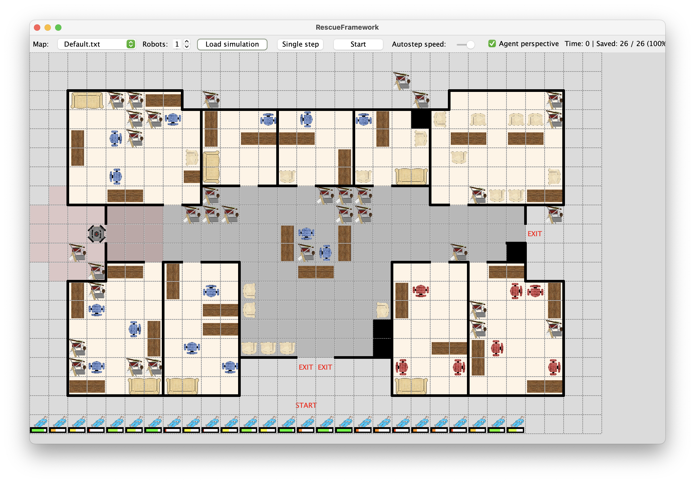
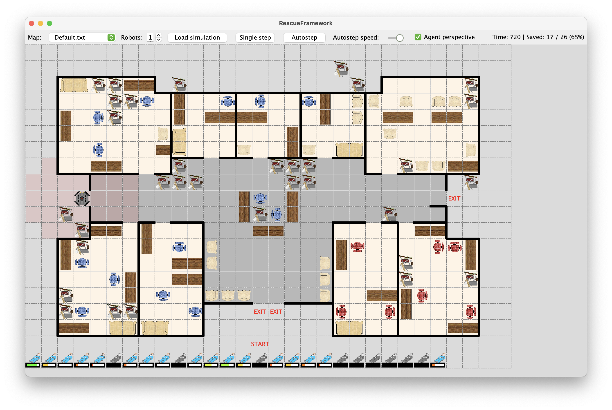
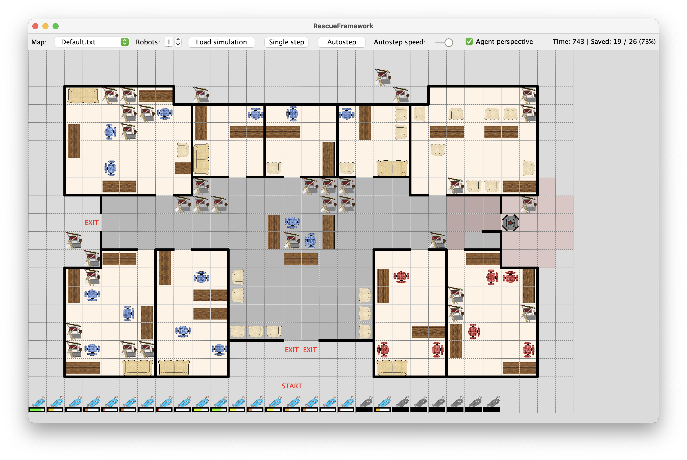
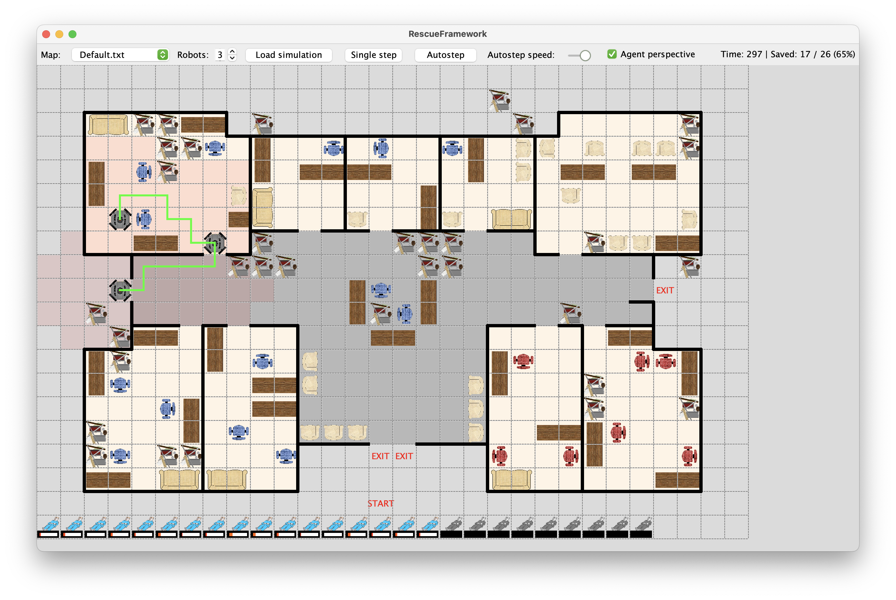

# Cim

## 1. feladat - Ismerkedés a szimulátorral


## 2. feladat - Autonóm vezérlés készítése
> A robot mindig ha van sérültje akkor az a célja hogy kivigye, ezután ha nincs akkor hogy a legközelebbi sérültet felszedje és amennyiben nem lát akkor felfedezi a legközelebbi nem ismert cellát.
```java
public Integer step() {
    if (robot.hasInjured()) {
        Path pathToExit = percepcion.getShortestExitPath(robot.getLocation());
        if (pathToExit != null) {
            return pathToExit.getFirstCell().directionFrom(robot.getLocation());
        }
    }
    Path pathToInjured = percepcion.getShortestInjuredPath(robot.getLocation());
    if (pathToInjured != null) {
        return pathToInjured.getFirstCell().directionFrom(robot.getLocation());
    } else {
        Path pathToUnknown = percepcion.getShortestUnknownPath(robot.getLocation());
        if (pathToUnknown != null) {
            return pathToUnknown.getFirstCell().directionFrom(robot.getLocation());
        }
    }
    return null;
}
```

> Sikeresen megtalál minden beteget de van amikor kifut az ideje és meghalnak az emberek. Viszont akiket lát azokat egyből megmenti tehát gyorsabban kikerülnek a kezdő pozícióhoz közelebbi sérültek.

## 3. feladat - Fejlettebb autonóm vezérlés
> A robot most megnézi hogy az éppen látott sebesültekből melyiknek van vészesen kevés élete (azaz melyik élete kevesebb mint a többinek vagy egyből ki kell menteni mert annyi élete van hogy kimentsék csak). A már halottakat priorizálja a legvégére.
```java
public Integer step() {
    if (robot.hasInjured()) {
        Path pathToExit = percepcion.getShortestExitPath(robot.getLocation());
        if (pathToExit != null) {
            return pathToExit.getFirstCell().directionFrom(robot.getLocation());
        }
    }

    List<Injured> seenInjured = percepcion.getDiscoveredInjureds();
    seenInjured.sort(
            (a, b) -> {
                if (a.getLocation() == null) {
                    return 1;
                } else if (b.getLocation() == null) {
                    return -1;
                }
                Path l1 = world.AStarSearch.search(robot.getLocation(), a.getLocation(), -1);
                Path l2 = world.AStarSearch.search(robot.getLocation(), b.getLocation(), -1);
                if (l1 == null) {
                    return 1;
                } else if (l2 == null) {
                return -1;
                } else {
                    return Integer.compare(l1.getLength(), l2.getLength());
                }
            }
    );
    List<Injured> seenSortedFiltered = seenInjured.stream().filter(injured -> injured != null && injured.isAlive()).toList();
    for (Injured injured : seenSortedFiltered) {
        if (injured == null || injured.getLocation() == null) {
            continue;
        }
        Path pathToInjured = world.AStarSearch.search(robot.getLocation(), injured.getLocation(), -1);
        if (pathToInjured != null) {
            return pathToInjured.getFirstCell().directionFrom(robot.getLocation());
        }
    }

    Path pathToUnknown = percepcion.getShortestUnknownPath(robot.getLocation());
    if (pathToUnknown != null) {
        return pathToUnknown.getFirstCell().directionFrom(robot.getLocation());
    } else if (!seenInjured.isEmpty()) {
         Path pathToDead = percepcion.getShortestInjuredPath(robot.getLocation());
        if (pathToDead != null) {
            return pathToDead.getFirstCell().directionFrom(robot.getLocation());
        }
    }

    return null;
}
```


> Most sikeresen több olyan beteget mentett ki aki közel ált a halálhoz. Jobban kéne felmérnie hogy a betegek kibírják e még hogy a robot megtaláljon esetlegesen súlyosabb embereket is.

## 4. feladat - Többágenses kísérletek
> Amennyiben többen vannak az elején sikerül kimenteni a közeli sebesülteket de a koordináció hiányában sajnos mindegyik robot ugyan abba az irányba haladnak így gyakorlatilag hagyják meghalni az embereket a felfedezetlen területeken.

> Amennyiben egy robot csak olyan beteget lát akinek az élete magasabb mint mondjuk a felfedezési út hossza illetve a visszamenetel a beteghez akkor a felfedezést preferálja, azért hogy rosszabb állapotú sérülteket előbb fellelje.

## 5. feladat - Együttműködő robotok
> Ha valamelyik robot már aktívan megy egy sérültért akkor másik ne próbáljon érte menni, illetve vegye figyelembe hogy lehet a kiszemelt embere azóta meghalt, akkor váltson célt, továbbá ha lát rá esélyt, hogy a felfedezés jobb stratégia mint egy sebesült akit megmenthetne akkor tegye azt.
```java
package rescueagents;

import rescueframework.AbstractRobotControl;
import world.Injured;
import world.Path;
import world.Robot;
import world.RobotPercepcion;

import java.util.*;

import static rescueframework.RescueFramework.log;

/**
 *  RobotControl class to implement custom robot control strategies
 */
public class RobotControl extends AbstractRobotControl{
    static HashMap<RobotControl, Injured> targetedInjured = new HashMap<>();
    /**
     * Default constructor saving world robot object and percepcion
     * 
     * @param robot         The robot object in the world
     * @param percepcion    Percepcion of all robots
     */
    public RobotControl(Robot robot, RobotPercepcion percepcion) {
        super(robot, percepcion);
    }
    
    
    /**
     * Custom step strategy of the robot, implement your robot control here!
     * 
     * @return  Return NULL for staying in place, 0 = step up, 1 = step right,
     *          2 = step down, 3 = step left
     */
    public Integer step() {
        if (robot.hasInjured()) {
            targetedInjured.remove(this);
            Path pathToExit = percepcion.getShortestExitPath(robot.getLocation());
            if (pathToExit != null) {
                return pathToExit.getFirstCell().directionFrom(robot.getLocation());
            }
        } else if (targetedInjured.get(this) != null && targetedInjured.get(this).isAlive()) {
            Path pathToInjured = world.AStarSearch.search(robot.getLocation(), targetedInjured.get(this).getLocation(), -1);
            if (pathToInjured != null) {
                return pathToInjured.getFirstCell().directionFrom(robot.getLocation());
            }
        } else {
            targetedInjured.remove(this);
        }

        List<Injured> seenInjured = percepcion.getDiscoveredInjureds();
        seenInjured.sort(
                (a, b) -> {
                    if (a.getLocation() == null) {
                        return 1;
                    } else if (b.getLocation() == null) {
                        return -1;
                    }
                    Path l1 = world.AStarSearch.search(robot.getLocation(), a.getLocation(), -1);
                    Path l2 = world.AStarSearch.search(robot.getLocation(), b.getLocation(), -1);
                    if (l1 == null) {
                        return 1;
                    } else if (l2 == null) {
                        return -1;
                    } else {
                        return Integer.compare(l1.getLength(), l2.getLength());
                    }
                }
        );
        List<Injured> seenSortedFiltered = seenInjured.stream().filter(injured -> injured != null && injured.isAlive()).toList();
        for (Injured injured : seenSortedFiltered) {
            boolean isTargeted = targetedInjured.containsValue(injured);
            if (injured == null || isTargeted || injured.getLocation() == null) {
                continue;
            }
            Path pathToUnknown = percepcion.getShortestUnknownPath(robot.getLocation());
            if (pathToUnknown != null) {
                Path pathFromUnknownToInjured = world.AStarSearch.search(pathToUnknown.getPath().getLast(), injured.getLocation(), -1);
                if (pathFromUnknownToInjured == null) {
                    continue;
                }
                int pathToUnknownLength = pathToUnknown.getLength();
                int pathFromUnknownToInjuredLength = pathFromUnknownToInjured.getLength();
                int pathFromInjuredToExitLength = percepcion.getShortestExitPath(injured.getLocation()).getLength();
                double minLength = (pathToUnknownLength + pathFromUnknownToInjuredLength + pathFromInjuredToExitLength) * percepcion.getRobots().size();
                if (injured.getHealth() - minLength > 100) {
                    return pathToUnknown.getFirstCell().directionFrom(robot.getLocation());
                }
            }
            Path pathToInjured = world.AStarSearch.search(robot.getLocation(), injured.getLocation(), -1);
            if (pathToInjured != null) {
                targetedInjured.put(this, injured);
                return pathToInjured.getFirstCell().directionFrom(robot.getLocation());
            }
        }

        Path pathToUnknown = percepcion.getShortestUnknownPath(robot.getLocation());
        if (pathToUnknown != null) {
            return pathToUnknown.getFirstCell().directionFrom(robot.getLocation());
        }

        if (!seenInjured.isEmpty()) {
            Path pathToDead = percepcion.getShortestInjuredPath(robot.getLocation());
            if (pathToDead != null) {
                return pathToDead.getFirstCell().directionFrom(robot.getLocation());
            }
        }

        return null;
    }
}
```

> Az ágensek sokkal effektívebben döntenek a sebesültek megmentési stratégiájáról bár nem tökéletes mert van olyan eset, hogy hagyják meghalni a sebesültet mert pont ugyan olyan opciónak látszik felderíteni mint menteni.
